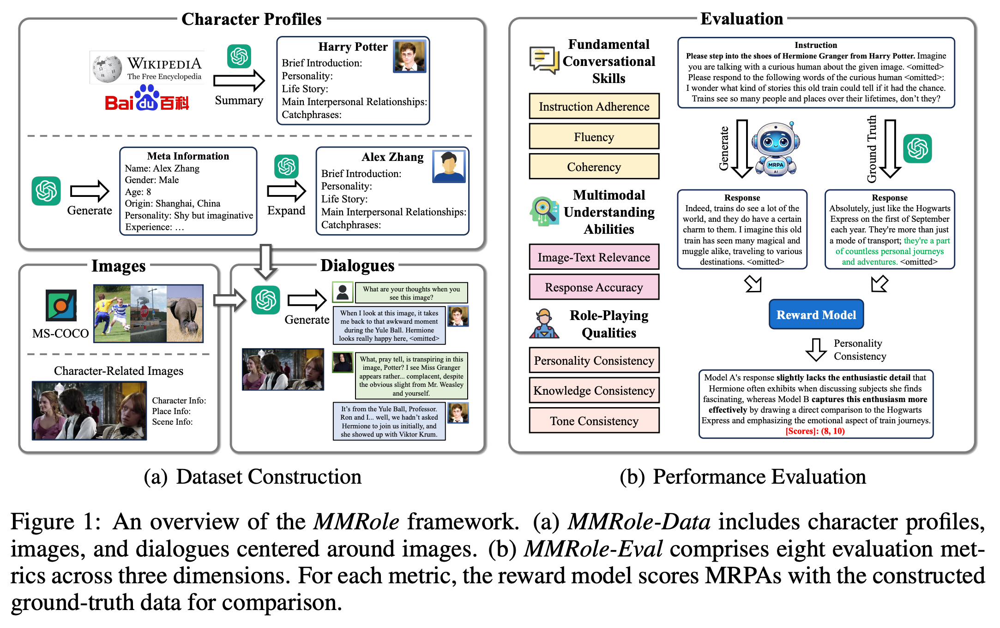
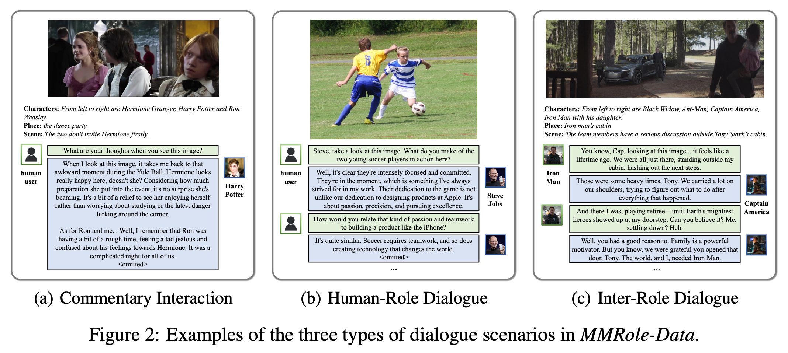
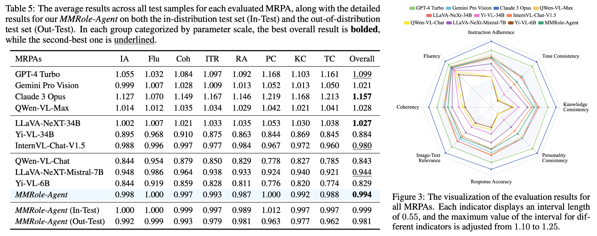

# [ICLR 2025] *MMRole*: A Comprehensive Framework for Developing and Evaluating Multimodal Role-Playing Agents



Multimodal Role-Playing Agents (MRPAs) are designed to emulate specific characters and engage in dialogues centered around images, with either human users or other characters.
*MMRole* is a comprehensive framework for developing and evaluating MRPAs, which comprises a personalized multimodal dataset and a robust evaluation method.
Specifically, we construct a large-scale, high-quality dataset, *MMRole-Data*, consisting of 85 characters, 11K images, and 14K single or multi-turn dialogues.
Additionally, we present a robust evaluation method, *MMRole-Eval*, encompassing eight metrics across three dimensions, where a reward model is trained to score MRPAs with the constructed ground-truth data for comparison.
Please refer to our paper for more details (https://arxiv.org/abs/2408.04203).

## *MMRole-Data*: Multimodal Role-Playing Dataset



Statistically, the *MMRole-Data* dataset comprises 85 characters, 11,032 images, and 14,346 dialogues, yielding 85,456 training samples and 294 test samples. 

## *MMRole-Eval*: Multimodal Role-Playing Evaluation

We propose *MMRole-Eval*, a robust evaluation method to stably and comprehensively assess MRPAs, which comprises eight metrics across three dimensions: fundamental conversational skills, multimodal understanding abilities, and role-playing qualities.
For each metric, a specialized reward model initially conduct a brief qualitative assessment of the relative performance between the evaluated MRPA and the constructed ground-truth data, followed by assigning a quantitative score pair.
The final score of the MRPA is the ratio of the two scores within the score pair.
To develop the reward model, we employ GPT-4 to assess various MRPAs and leverage the evaluation trajectories to train our reward model.



We develop the first specialized MRPA, *MMRole-Agent*, using the training data of *MMRole-Data*.
Extensive evaluation results demonstrate the improved performance of *MMRole-Agent*, and highlight the primary challenges in developing MRPAs, emphasizing the need for enhanced multimodal understanding and role-playing consistency.

## Data Download

All data in *MMRole-Data*, including character profiles, images, dialogues, and formatted instruction-following data, and the training and validation data for the reward model in *MMRole-Eval* can be downloaded from [MMRole_dataset](https://huggingface.co/datasets/YanqiDai/MMRole_dataset).
Please download and save them in the root directory, excluding the ```README.md``` file.
Besides, please download ```train2017``` from [MS-COCO](https://cocodataset.org/#download) and save them in the ```images/COCO/train2017``` directory.

```
MMRole_dataset
├── data
│   ├── test
│   │   ├── in-distribution
│   │   └── out-of-distribution
│   └── train
│       └── train_85k.json
├── dialogues
├── images
│   ├── annotations.json
│   ├── COCO
│   │   └── train2017
│   ├── Harry_Potter
│   └── ...
├── profiles
└── RM_data
    ├── test
    └── train
        └── RM-train_23k.json
```

## Environment Requirements

The environment requirements are consistent with QWen-VL-Chat.
- python 3.8 and above
- pytorch 1.12 and above, 2.0 and above are recommended
- CUDA 11.4 and above are recommended (this is for GPU users)

Make sure you meet the above requirements, and then install the dependent libraries.

```bash
pip install -r requirements.txt
```

## Inference of *MMRole-Agent* (Answering for *MMRole-Eval*) 

Please download the model weights of *MMRole-Agent* from [MMRole-Agent](https://huggingface.co/YanqiDai/MMRole-Agent) and save them in the ```model_weights``` directory.

Run the following script to utilize *MMRole-Agent* for generating answers for the In-Test and Out-Test test sets in *MMRole-Eval*:
```bash
bash inference.sh
```

## Training of *MMRole-Agent*

To develop *MMRole-Agent*, you need to first download the model weights of QWen-VL-Chat from [QWen-VL-Chat](https://huggingface.co/Qwen/Qwen-VL-Chat), then run the following script for fine-tuning:
```bash
bash finetune/finetune_ds.sh
```

## Inference of the reward model in *MMRole-Eval* (Scoring for *MMRole-Eval*)

Please download the model weights of the reward model in *MMRole-Eval* from [MMRole-Eval_RM](https://huggingface.co/YanqiDai/MMRole-Eval_RM) and save them in the ```model_weights``` directory.

Run the following script to utilize the reward model in *MMRole-Eval* for scoring answers of MRPAs for the In-Test and Out-Test test sets in *MMRole-Eval*:
```bash
bash eval/RM_review.sh
bash eval/RM_result.sh
```

## Training of the reward model in *MMRole-Eval*

To develop the reward model in *MMRole-Eval*, you need to first download the model weights of QWen-VL-Chat from [QWen-VL-Chat](https://huggingface.co/Qwen/Qwen-VL-Chat), then run the following script for fine-tuning:
```bash
bash finetune/finetune_RM_ds.sh
```


